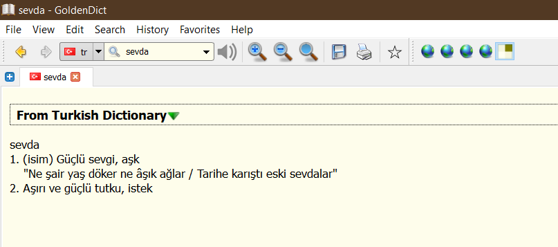

A Python script to convert dictionary data in JSON format downloaded from [ogun/guncel-turkce-sozluk](https://github.com/ogun/guncel-turkce-sozluk) or https://sozluk.gov.tr/ to the [DICT format](https://en.wikipedia.org/wiki/DICT#Dict_file_format)
for use in programs like [GoldenDict](http://www.goldendict.org/).

## Usage

```
usage: tdk2dict.py [-h] [--name NAME] [--out FILE] [--start START] [--end END] FILE

Converts a JSON file taken from sozluk.gov.tr or ogun/guncel-turkce-sozluk and outputs two files in the DICT format.

positional arguments:
  FILE           the JSON file to process

optional arguments:
  -h, --help     show this help message and exit
  --name NAME    specify the name of the dictionary
  --out FILE     specify name of the produced .index and .dict files
  --start START  start importing from the entry with the specified index
  --end END      stop importing before the entry with the specified index
```

## Download

If you want all the dictionary data, you can just download pre-generated files from the [releases page](https://github.com/abdnh/tdk2dict/releases/).

## TODO

Currently definitions, example sentences, and properties are imported. Maybe there are other useful info to import?

## References

- Tested with the JSON file obtained from here: https://github.com/ogun/guncel-turkce-sozluk/blob/master/sozluk/gts.json.tar.gz
- Man page of the `dictfmt` command used to produce the DICT files: https://linux.die.net/man/1/dictfmt
- About the DICT format: https://en.wikipedia.org/wiki/DICT#Dict_file_format
